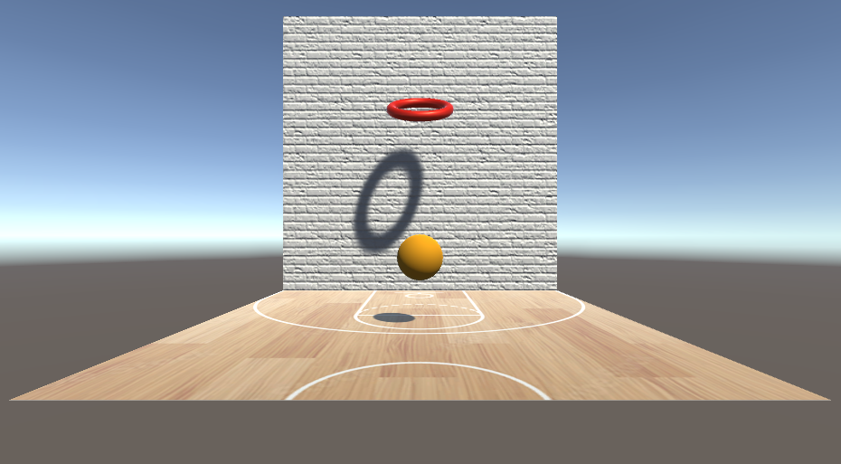

# Hoops

A simple Unity game demo.

You click on the ball to shoot. The longer you hold the click down, the more force you use. The ball respawns in a fixed time after each shot.

Mostly for my students to use in courses I offer at the University of Maryland, College Park. If you're not one of my students, feel free to use this code anyway. If you're interested in becoming a student, let me know.

